# 📊 Diagramas da Arquitetura

Documentação visual completa da arquitetura, fluxos e componentes do projeto usando Mermaid.

## 🏗️ Clean Architecture - 5 Camadas

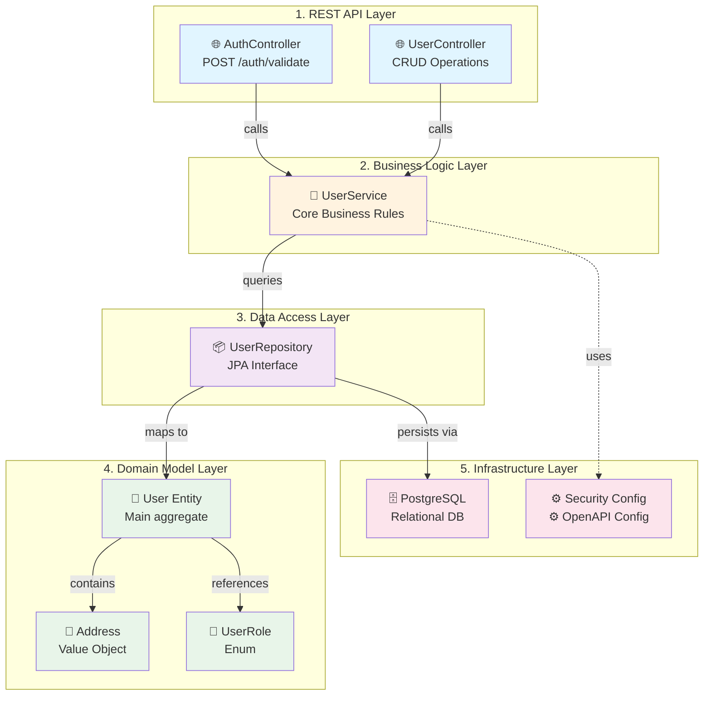

## 🔄 Request-Response Cycle

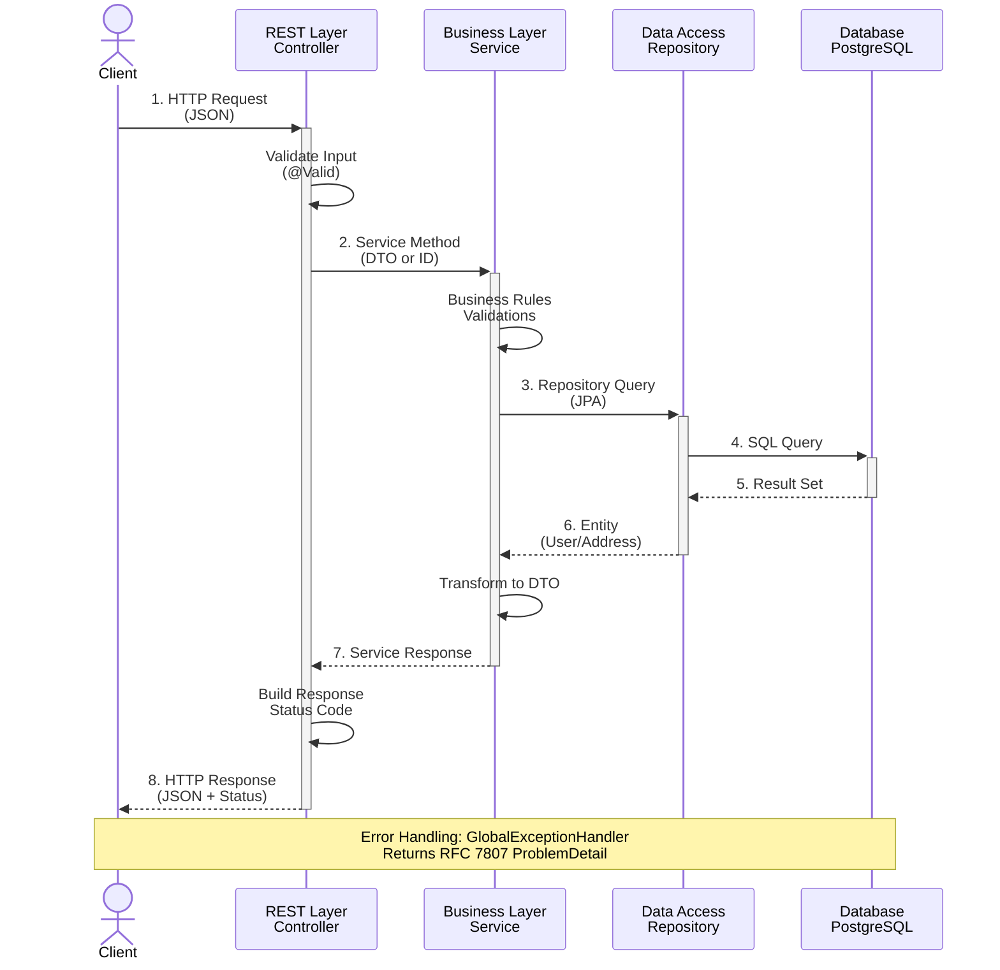

## 🗄️ Entity-Relationship Diagram

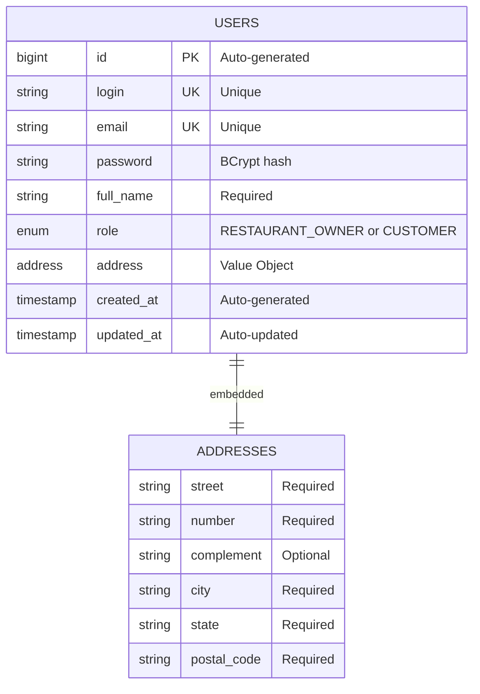

## 🔐 Security & Validation Flow

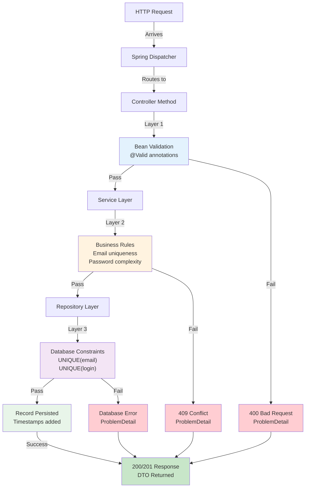

## 📁 Pacotes & Classes - Class Diagram Simplificado

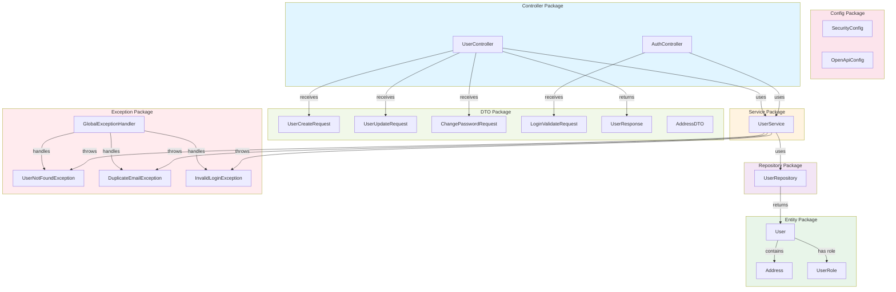

## 🧪 Test Coverage Distribution

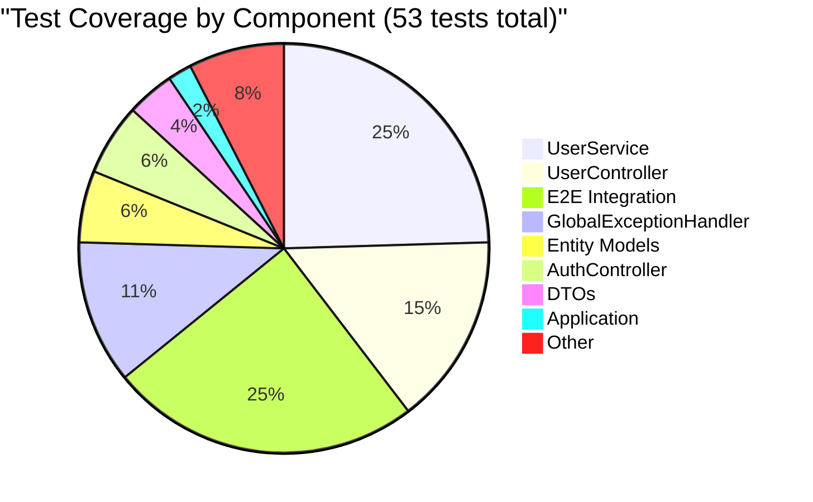

## 📈 Coverage by Layer

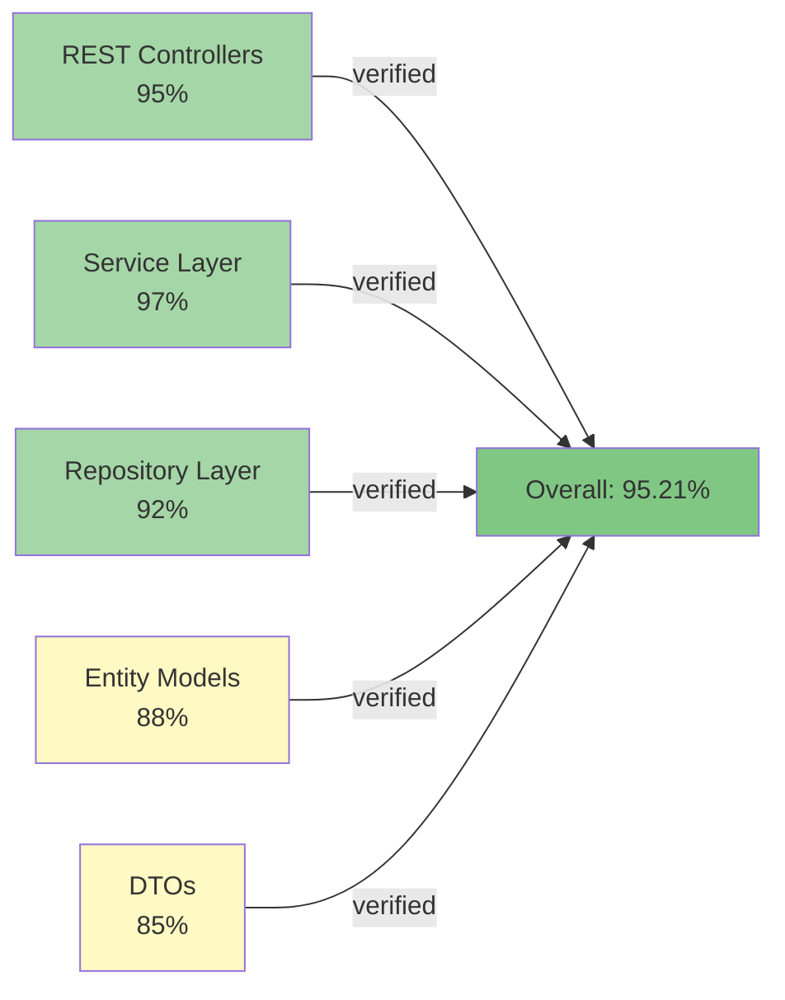

## 🚀 Deployment Flow

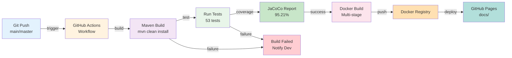

## 🔌 API Endpoints Map

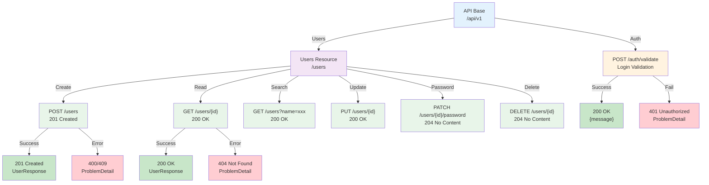

## 📦 Dependencies & Frameworks

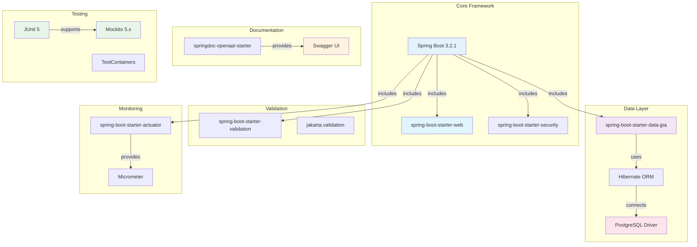

## 🔍 Exception Handling Strategy

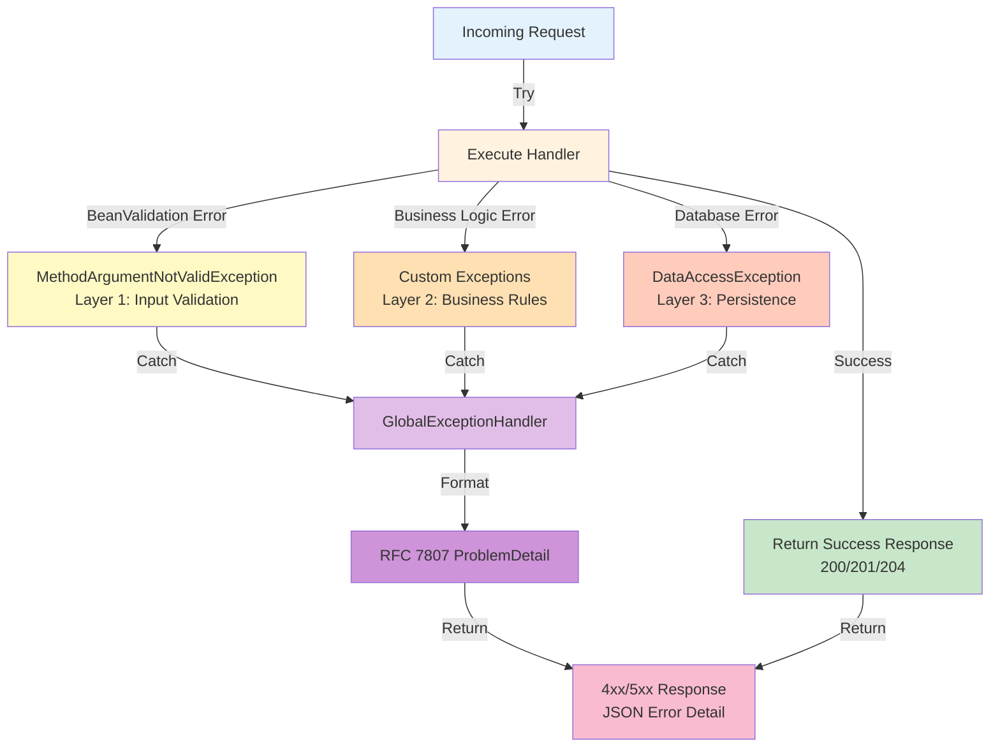

## 🧬 Domain Model Structure

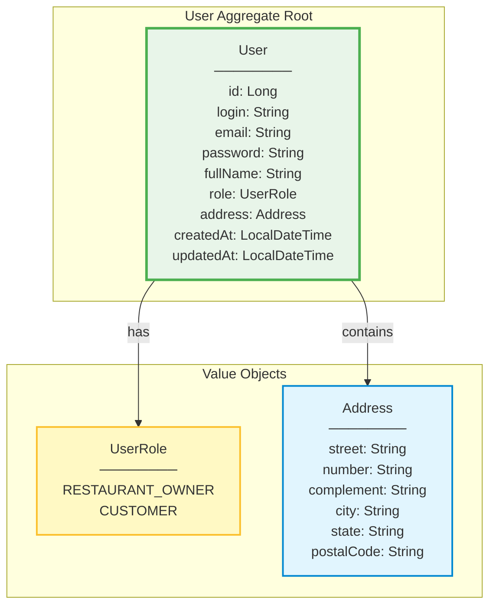

---

## 📚 Referências

- **Clean Architecture**: [The Clean Code Blog](https://blog.cleancoder.com/uncle-bob/2012/08/13/the-clean-architecture.html)
- **SOLID Principles**: [SOLID Explained](https://en.wikipedia.org/wiki/SOLID)
- **Spring Boot Docs**: [spring.io](https://spring.io)
- **Mermaid Diagrams**: [mermaid.js.org](https://mermaid.js.org)
