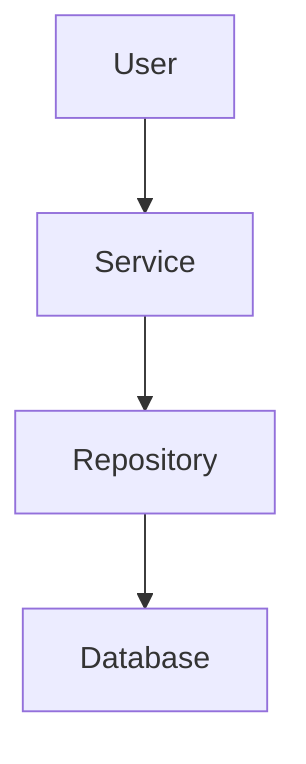

# 🚀 GitHub Pages Setup Guide

Guia completo para publicar documentação no GitHub Pages automaticamente.

## 📋 Pré-requisitos

- ✅ Repositório GitHub criado
- ✅ Git configurado localmente
- ✅ Branch `main` ou `master` como principal

## 🔧 Passo 1: Configurar Repositório GitHub

### 1.1 Fazer Push do Projeto

```bash
# Se ainda não tem repositório remoto
git remote add origin https://github.com/SEU_USUARIO/fiap-tech-challenge-1.git

# Fazer push de tudo para o repositório
git branch -M main
git push -u origin main
```

### 1.2 Ativar GitHub Pages

1. Vá para **Settings** → **Pages**
2. Em **Source**, selecione:
   - Branch: `main` (ou `master`)
   - Folder: `/ (root)`
3. Clique em **Save**

```
Seu site será publicado em:
https://SEU_USUARIO.github.io/fiap-tech-challenge-1
```

## 🤖 Passo 2: Workflow GitHub Actions

O arquivo `.github/workflows/pages.yml` já está criado. Ele:

✅ Ativa automaticamente no push para `main`  
✅ Compila com Jekyll  
✅ Publica no GitHub Pages automaticamente  

**Nenhuma configuração adicional necessária!**

## 📝 Passo 3: Configuração Jekyll (_config.yml)

O arquivo `_config.yml` já está configurado com:

```yaml
title: FIAP Tech Challenge - Phase 1
description: Sistema de Gerenciamento de Usuários
theme: jekyll-theme-slate
```

**Está pronto para usar!**

## 📄 Passo 4: Estrutura de Documentação

### Organização de Arquivos

```
raiz/
├── README.md                    ← Página inicial (automática)
├── QUICK_START.md              ← Quick start
├── ARCHITECTURE.md             ← Arquitetura técnica
├── PROJECT_SUMMARY.md          ← Resumo do projeto
├── DIAGRAMS.md                 ← Diagramas Mermaid
├── INDEX.md                    ← Índice navegação
├── CONTRIBUTING.md             ← Como contribuir
├── COMPLETION_REPORT.md        ← Relatório final
├── _config.yml                 ← Configuração Jekyll
├── docs/
│   └── index.html             ← Landing page HTML
└── postman_collection.json     ← Postman collection
```

## 🎨 Passo 5: Personalizar Landing Page

O arquivo `docs/index.html` contém a página inicial com:

- ✨ Design responsivo (gradiente roxo)
- 📊 Diagramas Mermaid interativos
- 📚 Links para documentação
- 🔌 Tabela de endpoints
- 🛠️ Stack tecnológico
- ✅ Checklist de requisitos

Personalize editando:

```html
<h1>🚀 FIAP Tech Challenge</h1>
<p>Sistema de Gerenciamento de Usuários - Phase 1</p>
```

## 📊 Passo 6: Adicionar Diagramas Mermaid

O arquivo `DIAGRAMS.md` contém diagramas prontos:

### Visualizar Localmente

No GitHub Pages, os diagramas são renderizados automaticamente:

```markdown

```

### Diagramas Inclusos

- 🏗️ Clean Architecture (5 camadas)
- 🔄 Request-Response Cycle
- 🗄️ Entity-Relationship Diagram
- 🔐 Security & Validation Flow
- 📊 Test Coverage Distribution
- 📈 Coverage by Layer
- 🚀 Deployment Flow
- 🔌 API Endpoints Map
- 📦 Dependencies & Frameworks
- 🔍 Exception Handling Strategy
- 🧬 Domain Model Structure

## 🚀 Passo 7: Workflow de Publicação

### Fluxo Automático

1. **Faça commit e push**
   ```bash
   git add .
   git commit -m "Docs: Add GitHub Pages setup"
   git push origin main
   ```

2. **GitHub Actions dispara automaticamente**
   - ✅ Compila com Jekyll
   - ✅ Publica em GitHub Pages
   - ✅ Disponível em ~2 minutos

3. **Acesse seu site**
   ```
   https://SEU_USUARIO.github.io/fiap-tech-challenge-1
   ```

### Monitorar Build

1. Vá para **Actions** no repositório
2. Veja o status do workflow `Deploy GitHub Pages`
3. Clique para ver logs detalhados

## 🔍 Passo 8: Verificar Publicação

### Checklist

- [ ] Repositório no GitHub criado e com push feito
- [ ] Settings → Pages ativado com branch `main`
- [ ] `.github/workflows/pages.yml` criado
- [ ] `_config.yml` na raiz
- [ ] `docs/index.html` criado
- [ ] Arquivos .md na raiz (README, QUICK_START, etc.)
- [ ] Workflow executado com sucesso (check Actions)
- [ ] Site acessível em `https://SEU_USUARIO.github.io/fiap-tech-challenge-1`

## 📝 Passo 9: Adicionar Arquivo .gitignore

Certifique-se de que `.gitignore` tem:

```
# Build
target/
_site/
.sass-cache/

# IDE
.vscode/
.idea/
*.swp
*.swo

# Environment
.env
.env.local
*.properties.local

# OS
.DS_Store
Thumbs.db

# Dependencies
node_modules/
.bundle/
vendor/
```

## 🎯 Passo 10: Customizações Adicionais

### Adicionar Google Analytics (opcional)

Em `_config.yml`:

```yaml
google_analytics: UA-XXXXXXXX-X
```

### Customizar Tema (opcional)

Em `_config.yml`:

```yaml
theme: jekyll-theme-slate
# Outras opções: minimal, dinky, leap-day, merlot, midnight, minimal, modernist, etc.
```

### Adicionar Favicon

Coloque `favicon.ico` na raiz:

```html
<!-- Em docs/index.html -->
<link rel="icon" type="image/x-icon" href="/favicon.ico">
```

## 🆘 Troubleshooting

### Site não está aparecendo

1. Verifique se Pages está ativado em Settings
2. Verifique o branch correto (main/master)
3. Verifique logs em Actions
4. Aguarde 2-3 minutos após push

### Diagrama Mermaid não renderiza

1. Confirme que usa ```mermaid (com tripla backtick)
2. Mermaid é renderizado no navegador (JS)
3. GitHub Pages suporta Mermaid nativamente

### Build falha no Actions

1. Clique no workflow para ver logs
2. Verifique se `_config.yml` tem sintaxe YAML correta
3. Confirme que não há caracteres especiais nos nomes de arquivo

## 📚 Recursos Úteis

- [GitHub Pages Docs](https://docs.github.com/en/pages)
- [Jekyll Docs](https://jekyllrb.com)
- [Mermaid Docs](https://mermaid.js.org)
- [GitHub Actions](https://github.com/features/actions)
- [Markdown Cheatsheet](https://github.github.com/gfm/)

## 🎉 Resultado Final

Após completar todos os passos:

```
✅ Site publicado automaticamente
✅ Documentação acessível online
✅ Diagramas renderizados
✅ Responsive design
✅ Dark mode (tema Slate)
✅ URL amigável: https://usuario.github.io/fiap-tech-challenge-1
```

## 💡 Dicas Finais

1. **Atualize README.md** com link para Pages:
   ```markdown
   📖 [Documentação Online](https://usuario.github.io/fiap-tech-challenge-1)
   ```

2. **Use a Branch Protection** para garantir qualidade:
   - Settings → Branches → Add Rule
   - Require pull request reviews
   - Require status checks to pass

3. **Configure o CNAME** se quiser domínio customizado:
   ```
   seudominio.com
   ```

4. **Monitore o tráfego** em Insights → Traffic

---

**Status**: ✅ Pronto para publicar no GitHub Pages  
**Próximo passo**: Fazer git push e aguardar 2-3 minutos
